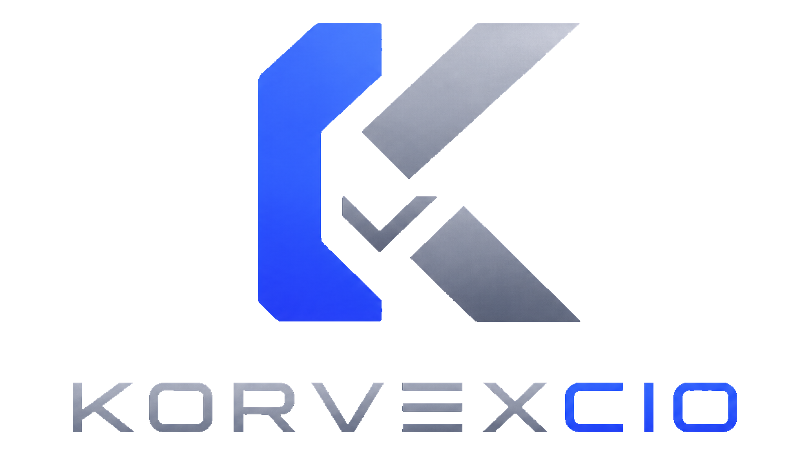

  

# KORVEXCIO

ERP + POS multi-tenant sobre **ERPNext/Frappe v16** para retail y food en
República Dominicana. Producto de la casa **KORVEX**. Primer cliente: dos
negocios del mismo dueño — **VAPERIA LA J Y EL JALAPEÑO** (vapería) y **EL
SABOR DE LAS 5 ESQUINAS** (cafetería) — operando desde un solo panel.

**Estado:** 🟢 Fase 0 y Fase 1 cerradas (31/08/2026). Fase 2 (módulo `ecf`) en
curso. Detalle slice por slice, con evidencia real, en [`PROGRESO.md`](PROGRESO.md).

---

## Nomenclatura — la familia de marcas

| Nombre | Qué es |
|---|---|
| **KORVEX** | La casa. Korvex Dev · `korvexdev.cc` |
| **KORVEXCIO** | **Este producto.** De *comerCIO*. Repo: `yedinrumba-eng/KORVEXCIO` · app de Frappe: `korvexcio` |
| **KORVIS** | *The AI Assistant by Korvex* — el bot de WhatsApp. Otro producto de la casa |
| **VAPELAND** | Codename interno del cliente 1 en este repo — no el nombre de ninguna `Company` real |

Los dos negocios reales del cliente 1 son las Companies `VAPERIA LA J Y EL
JALAPEÑO` (`VLJ`) y `EL SABOR DE LAS 5 ESQUINAS` (`ESE`), en un solo site
(`korvexcio.korvexdev.cc`) — D19, ver `docs/08-BLUEPRINT.md` §5.2.

---

## Empezar aquí

Léase en este orden, siempre:

1. **`docs/08-BLUEPRINT.md`** — el plan maestro: fases, microslices, la
   verificación de cada uno. Fuente de verdad del qué y del orden.
2. **`PROGRESO.md`** — la bitácora. La última entrada dice exactamente dónde
   quedó el trabajo, con la salida real de los comandos que lo probaron.
3. **`HANDOFF.md`** — el porqué del proyecto, las trampas del nodo, y
   "Lecciones ya pagadas" — bugs reales ya resueltos, para no volver a
   pagarlos.
4. **`PROMPT-CLAUDE-CODE.md`** — el prompt listo para pegar en una sesión
   nueva de Claude Code o Codex.

## La fecha que manda

**15 de noviembre de 2026** — e-CF obligatorio para pequeños, micro y no
clasificados (Ley 32-23). Multa: 5 a 50 salarios mínimos. El módulo fiscal
(Fase 2) es el camino crítico; todo lo demás se difiere.

## Stack

Frappe Framework v16 · ERPNext v16 · MariaDB · Redis 7 · POSNext (spike con
evidencia, pendiente confirmar — `docs/10-SPIKE-POS.md`) · Docker Compose
(dev y prod, imagen propia vía `apps.json`) · Cloudflare Tunnel →
`*.korvexdev.cc`. Detalle y porqué de cada pieza en `TECH_STACK.md`.

## Los archivos

| Archivo | Qué contiene |
|---|---|
| `docs/08-BLUEPRINT.md` | El plan maestro — fases, slices, verificación, reglas del ejecutor |
| `PROGRESO.md` | Bitácora con evidencia real de cada slice cerrado |
| `HANDOFF.md` | Estado técnico, trampas del nodo, lecciones ya pagadas |
| `PROMPT-CLAUDE-CODE.md` | Prompt listo para pegar en una sesión nueva |
| `TECH_STACK.md` | Decisiones técnicas (D1–D19) con su porqué |
| `CLAUDE.md` | Reglas obligatorias del repo |
| `korvexcio/` | La app de Frappe — módulos `ECF` y `Retail` |
| `docs/06-COMO-SE-TRABAJA.md` | Cómo se extiende ERPNext sin tocar el upstream |
| `docs/10-SPIKE-POS.md` | Veredicto del spike de POS, con evidencia de código |
| `docs/13-VERSION-FRAPPE.md` | Evidencia operativa del bench (D2 cerrada en v16) |

## Licencia

⚠️ **Pendiente de corregir** — el archivo `LICENSE` de este repo dice MIT,
pero la app hereda de ERPNext (GPLv3) y **tiene que ser GPLv3**. Decisión de
Yedin, sin resolver todavía. El `hooks.py` de la app ya declara
`app_license = "gpl-3.0"`; el archivo de la raíz es aparte.

Este producto no puede llamarse "ERPNext" ni "Frappe" en ningún lugar del
nombre, la marca o el dominio — son marcas registradas de Frappe
Technologies Pvt. Ltd. Se mantiene visible su aviso de copyright.
